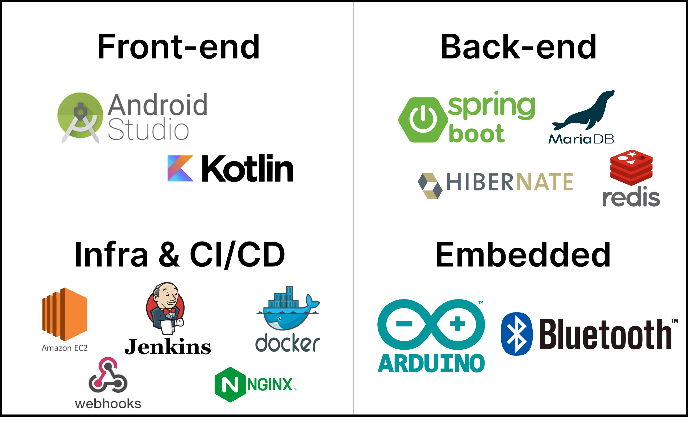

### Intro

💡 올바른 약 복용은 “처방된 용량대로, 정확한 복용법을 준수하여, 지시된 처방기간을 제대로 지키는 것” 입니다. ***지금이:약*** 은 이를 보조하기 위해 스마트 약통과 어플을 통해 약물 복용 관리를 간편하고 효과적으로 지원하는 서비스입니다. 사용자는 정해진 약 복용 시간에 약물을 복용할 수 있도록 어플 알림 뿐만 아니라 IoT기기에서 알림을 받습니다. 또한 약물 정보, 복용 기록, 건강설문을 통한 종합적인 건강 관리가 가능합니다.

---

### ⭐ Link

📌 [Notion](https://www.notion.so/10bd0fb43ca041dba207806a7fe842ed?pvs=21)

📌 [Youtube](https://www.youtube.com/watch?v=f0LNya78P78)

📌 [Google Play](https://play.google.com/store/apps/details?id=com.a103.eyakrev1)

📌 [Presentation](https://www.miricanvas.com/v/12bdetn)

---

## A. Ground Rule

🚩**Rule**

1. 항상 **기록**하고 기록을 가까이
2. **이슈**는 바로 **공유**
3. 모르거나 의논하고 싶은 것 언제든지 이야기
4. **번아웃** 주의
5. 모른다고 혼내지 말기
6. **과정을 즐기기**🎵

[Git Convention](https://www.notion.so/Git-Convention-b5cb897411ec4191afd01d42ecfd5ed5?pvs=21) 

[Git Flow](https://www.notion.so/Git-Flow-ab891096a85141c18e8886938e66ef7d?pvs=21) 

---

## B. 주요 기능

### 1. Member
| 안드로이드 사용자가 모두 가지고 있는 구글로그인을 통해 회원가입이 가능합니다. 회원 정보 등록시 사용자의 6가지 루틴(일어나는 시간, 아침 식사 시간, 점심 식사 시간, 저녁 식사 시간, 잠자는 시간, 식사 시간)에 대한 정보를 입력 받고, 앞으로의 복용 알림에 사용됩니다.
| 회원가입 | 회원수정 | 회원탈퇴 | 
|:---:|:---:|:---:|
| |  |  |

### 2.  Prescription
| 처방전 단위로 약의 정보를 등록가능합니다. 약의 이름은 사용자가 알아보기 쉬운 이름으로 등록할 수 있습니다. 약을 등록할 때는, 8가지 루틴(일어나는 시간, 아침식사 전/후, 점심식사 전/후, 저녁식사 전/후, 잠자기전)에 해당하는 시간 설정을 하게 됩니다.
| 복약추가 |복약정보수정|복약삭제| 
|:---:|:---:|:---:|
| |  |  |

### 3. Alarm
| 사용자의 일상 루틴에 따라 약을 복용해야 하는 시간을 자동으로 계산하여 알림을 주게 됩니다. 
|알림 탭 들어가서 확인|복용 알림 및 복용 확인 버튼 누르기| 
|:---:|:---:|
| |  |

### 4. Survey
| 매일 오늘의 컨디션, 보유 증상, 기타 특이사항에 대한 정보를 입력할 수 있습니다. 

### 5. PDF
| 사용자가 입력한 기간의 복약 정보 및 건강 설문 정보를 조회할 수 있으며, pdf로 저장해 병원에서의 정기 진료 시 의료진에게 간편하게 보여줄 수 있습니다. 의료진은 환자의 상태에 대해 추적관찰이 가능하며 앞으로의 치료에 대한 팔로우업이 용이해집니다.
| pdf 저장 |pdf 결과|
|:---:|:---:|
|| 

### 6. Follow
| 사용자는 나의 복약 정보와 건강설문을 열람할 수 있는 가족을 등록할 수 있습니다. 가족을 추가할 때, 공개범위(전체공개, 달력만 공개) 및 내가 지정할 이름을 설정할 수 있습니다. 요청을 받은 가족 또한 공개범위, 상대방의 이름을 설정할 수 있습니다. 전체공개로 설정된 가족은 세부적인 복약 정보와 건강 설문 내용을 조회할 수 있지만, 달력 공개의 경우 복약을 어느정도 했는지 여부만 열람할 수 있습니다.
|가족등록요청|요청수락|연결끊기|
|:---:|:---:|:---:|
|| |  |

|가족조회(전체공개)|가족조회(달력공개)|
|:---:|:---:|
| | |

### 7. Bluetooth
| 블루투스로 약통 등록 후 원하는 위치에 약을 보관합니다. 알람이 울릴 때, 해당하는 칸에 LED 불빛이 들어옵니다.

---
📌 [약통 디바이스 사용 설명서](https://www.notion.so/cbd8cce51bf24509b498a86e1346f098?pvs=21)

📌 [App 사용 설명서](https://www.notion.so/App-2be66b3378284d1c9259550ec60bb3d9?pvs=21)

---

## C. 개발 단계

### 1. 개발 기간

> 🗓️ 2023. 07. 04 ~ 2023. 08. 18.
> 

### 2. ERD

### 3. 📄[API Document](https://www.notion.so/API-Document-46f2ea74d51e4434b07b8e1be62182a9?pvs=21)

### 4. System Architecture

.png)

### 5. Entity Diagram

### 6. 🛠️[Skills](https://www.notion.so/6fd8ed2208c446759f69b32dc0adc5f7?pvs=21)

### 7. [Figma](https://www.figma.com/file/LCOxcKaxJ9ipqthfkJS529/Desktop?type=design&node-id=2-2&mode=design&t=SYoKf6Ml2PYGqBeR-0)

### 8. 명세서

📌 [요구사항 명세서](https://www.notion.so/87b545bdcbc54d6badf6d1feee768668?pvs=21)

📌 [기능 명세서](https://www.notion.so/1d15166fe4c44dfda384e8b8e7b4edd7?pvs=21)

📌 [기술 명세서](https://www.notion.so/208c6126fcbd4d3cae42e521a640499f?pvs=21)

---

## D. Member

| 김용우 | 조현기 | 고범수 | 박영서 | 백서영 | 손명주|
|:---:|:---:|:---:|:---:|:---:|:---:|
| Front-End | Front-End | Back-End | Back-End/Infra | Embedded | Embedded |
| [soybean33](https://github.com/soybean33) | [chk7082](https://github.com/chk7082) | [rhqjatn2398](https://github.com/rhqjatn2398) |[ysparrk](https://github.com/ysparrk) | [rainbow00unicorn](https://github.com/rainbow00unicorn) | [sonmyungju](https://github.com/sonmyungju) |

---