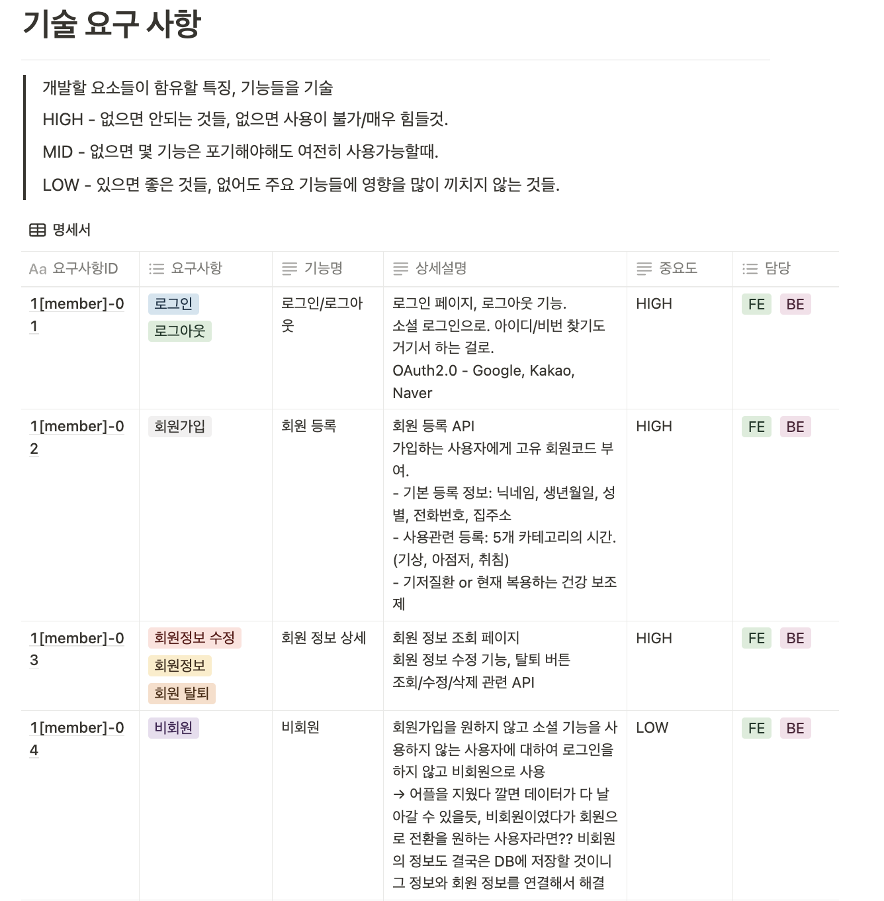

### 💊 지금이:약

올바른 약 복용을 위해 보호자와 함께 관리하는 안드로이드 어플리케이션 및 스마트 약통 서비스

#### Overview

> 💡 올바른 약 복용은 “처방된 용량대로, 정확한 복용법을 준수하여, 지시된 처방기간을 제대로 지키는 것” 입니다. <ins>**_지금이:약_** 은 이를 보조하기 위해 스마트 약통과 어플을 통해 약물 복용 관리를 간편하고 효과적으로 지원하는 서비스입니다.</ins> 사용자는 정해진 약 복용 시간에 약물을 복용할 수 있도록 어플 알림 뿐만 아니라 IoT기기에서 알림을 받습니다. 또한 약물 정보, 복용 기록, 건강설문을 통한 종합적인 건강 관리가 가능합니다.

 

## Project Info

🗓️ 2023. 07. 04 ~ 2023. 08. 18. (총 7주)

🏆 프로젝트 우수상

👨‍👩‍👧‍👧 Member

| [김용우](https://github.com/soybean33) | [조현기](https://github.com/chk7082) | [고범수](https://github.com/rhqjatn2398) | [박영서](https://github.com/ysparrk) | [백서영](https://github.com/rainbow00unicorn) | [손명주](https://github.com/sonmyungju) |
| :------------------------------------: | :----------------------------------: | :--------------------------------------: | :----------------------------------: | :-------------------------------------------: | :-------------------------------------: |
|                팀장/FE                 |                  FE                  |                    BE                    |               BE/Infra               |                   EMB                    |                EMB                 |

---

## ⚙️ 시스템 설계

### 🤝 [A. API Document](https://www.notion.so/API-Document-46f2ea74d51e4434b07b8e1be62182a9?pvs=21)

  
  

 

### 📄 [B. 기술 명세서](https://nice-forsythia-d4f.notion.site/208c6126fcbd4d3cae42e521a640499f?pvs=4)

  
  

 

### C. System Architecture

.png>)
 

### D. ER-Diagram

 

### E. Entity Diagram

 

## 🛠️ Skills

#### Server

   
   
   
   
   
   
  

#### Database

   
  

#### Infra

   
   
   
   
  

#### Android

   
  

#### Embedded

   
  

#### Collaboration

   
   
   
   
  

 

## 🎬 담당 기능

#### 1. Prescription

처방전 단위로 약의 정보를 등록가능합니다. 약의 이름은 사용자가 알아보기 쉬운 이름으로 등록할 수 있습니다. 약을 등록할 때는, 8가지 루틴(일어나는 시간, 아침식사 전/후, 점심식사 전/후, 저녁식사 전/후, 잠자기전)에 해당하는 시간 설정을 하게 됩니다.

#### 2. Alarm

사용자의 일상 루틴에 따라 약을 복용해야 하는 시간을 자동으로 계산하여 알림을 주게 됩니다.

#### 3. Survey

매일 오늘의 컨디션, 보유 증상, 기타 특이사항에 대한 정보를 입력할 수 있습니다.

#### 4. PDF

사용자가 입력한 기간의 복약 정보 및 건강 설문 정보를 조회할 수 있으며, pdf로 저장해 병원에서의 정기 진료 시 의료진에게 간편하게 보여줄 수 있습니다. 의료진은 환자의 상태에 대해 추적관찰이 가능하며 앞으로의 치료에 대한 팔로우업이 용이해집니다.

 

## ⭐ Issue

📌 **복용 약 알림 조회 기능 에러 해결**

- 문제: 복용 약 알림 조회 시 시작, 종료 날짜에 불필요한 알림 생성
- 원인:

  1. 약 등록 시 시작 시간을 기준으로 알림 정보를 생성하는 것이 아닌, N일치에 대한 알림을 생성 → 시작 날짜에 처방시점 이전의 알림 생성

  2. 스케줄러를 활용하여 daily로 복용해야 하는 약 리스트 생성 → 하지만 종료 일자에 약 복용이 끝난 이후의 알림 생성

- 해결:

  1. 스케줄러의 활용이 아닌 약 등록 시 등록 시점을 기준으로 복용 체크 column을 복약 시점 별로 모두 생성

  2. 이후 복용 체크 column 생성을 기준으로 복용 약 알림 조회

- 비고: 서버 시간에 대한 문제 발견 → AWS 서버 시간을 국내로 변경하여 해결

 

📌 **카테시안 곱(Cartesian Product) 문제 해결**

- 문제: 사용자가 입력한 기간에 대한 약 복용 정보와 데일리 설문에 대한 결과를 pdf로 조회하는 과정에서 중복되는 데이터가 들어감
- 원인: 해당 날짜에 대한 1) 약 복용 데이터, 2) 건강설문을 쿼리 한번으로 조회하려고 해 카테시안 곱 발생
- 해결: 1) 약 복용 데이터, 2) 건강설문을 각각 조회 후 dto에 담아서 해결

 

📌 **QueryDSL 사용 이유**

- 아침, 점심, 저녁 등 8가지 시간 상태에 따라 복용하는 약을 조회하는데 이 조건만 변경되게끔 조회했기 때문에 동적쿼리가 필요하다고 생각
- 정규화된 DB로 인해 복잡한 쿼리 작성 시 JPQL보다 가독성이 높다고 생각

 

📌 **CI/CD를 통한 효율적인 개발 프로세스 경험**

- 문제: Docker 컨테이너 내에서 SpringBoot 애플리케이션이 빌드되지 않는 문제 발생
- 원인: Docker in Docker(DinD) 방식
- 해결:

  1. Docker Out of Docker (DooD) 방식 사용

  2. 젠킨스 도커 이미지 내에 도커를 설치하는 것이 아닌 서버 내 설치되어 있는 도커를 이용해 도커를 실행

- 비고:

  1. Nginx에 HTTPS 인증서를 설치하여 보안성 높임

  2. JUnit 테스트를 통해 빌드 과정에서 예상치 못한 에러를 사전에 발견하여 수정

 

## 💭 회고

#### 프로젝트 경험

> 처음으로 6명을 이룬 팀 프로젝트를 진행하였습니다. SpringBoot를 처음 접하며 어려운 일도 많았지만, 부족함을 극복하기 위해 추가적인 강의를 듣고 공부하는 시간을 가졌습니다. 돌이켜보면 힘든 순간들도 많았지만 각자 맡은 역할을 200% 이상 다하는 팀원들 덕분이라고 생각합니다.

#### 프로젝트 기획

> 약 복용이 많은 만성질환자를 대상으로 하는 프로젝트를 기획하면서, 이전 병원에서 근무하며 많은 환자분들을 만난 경험이 도움이 되었습니다.

📌 [최종 발표 자료](https://www.miricanvas.com/v/12bdetn)

---

 

	
   
	

