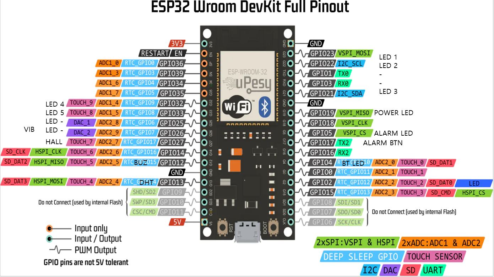

# 0. 기능 정리
* 개폐 인식
* 알림
    * 소리
    * 진동
    * 외부 LED (설정시 내부 칸별 LED까지)
* 복용 확인
* 온습도 측정
* C타입 충전
  

# 1. 부품리스트

|부품명|개수|datasheet|비고|
|---|---|---|---|
|[ESP32](https://mechasolution.com/shop/goods/goods_view.php?inflow=naverCheckout&goodsno=577245&NaPm=ct%3Dlk7wn8yo%7Cci%3Dcheckout%7Ctr%3Dppc%7Ctrx%3Dnull%7Chk%3D662cfa60a5264ec2c587c1b1c905d5b21609be4d)|1|[ESP-WROOM-32](https://www.espressif.com/sites/default/files/documentation/esp32-wroom-32_datasheet_en.pdf)|[pinout](https://www.studiopieters.nl/esp32-pinout/)|
|[배터리](https://www.devicemart.co.kr/goods/view?no=12710293&NaPm=ct%3Dlk7uzoh8%7Cci%3Dcheckout%7Ctr%3Dppc%7Ctrx%3Dnull%7Chk%3D01e099a8394dca5a8e5eaa4c50ad458c183a2c95)|1|DTP103040|
|[충전 모듈](https://mechasolution.com/shop/goods/goods_view.php?inflow=naverCheckout&goodsno=588193&NaPm=ct%3Dlk7vihg6%7Cci%3Dcheckout%7Ctr%3Dppc%7Ctrx%3Dnull%7Chk%3D2bfeab2ee8b2d277b83d5f2b7ae5859254e7fe4d)|1|
|온습도센서|1|[DHT11](https://components101.com/sensors/dht11-temperature-sensor)|[detail](https://www.mouser.com/datasheet/2/758/DHT11-Technical-Data-Sheet-Translated-Version-1143054.pdf)|
|[홀 센서](https://www.devicemart.co.kr/goods/view?no=29552&NaPm=ct%3Dlk7v7fpq%7Cci%3Dcheckout%7Ctr%3Dppc%7Ctrx%3Dnull%7Chk%3D3f5cbfc8faa321c937f3f73126735f37c6905b3f)|1|WSH135-XPAN2|[유사 제품 예제](https://samstory.coolschool.co.kr/zone/story/codingarray/streams/45101)|
|[진동모터](https://mechasolution.com/shop/goods/goods_view.php?inflow=naverCheckout&goodsno=330380&NaPm=ct%3Dlk7vg318%7Cci%3Dcheckout%7Ctr%3Dppc%7Ctrx%3Dnull%7Chk%3Da601f1a3d6b4585501abc2e8a20c4ba6e4194a09)|1|ZAS-XQ-VIBE1|[예제](https://cafe.naver.com/mechawiki/57)
|부저|1||
|버튼|1||
|외부용 LED|1||
|[내부용 LED (2mm)](https://mechasolution.com/shop/goods/goods_view.php?inflow=naverCheckout&goodsno=540594&NaPm=ct%3Dlk7vpp0d%7Cci%3Dcheckout%7Ctr%3Dppc%7Ctrx%3Dnull%7Chk%3D9f8a107c79bacf7e14b3938fcd8eddc3fc1a8f7b)|8||
|자석|2||

etc: 커버, 저항

# 2. 회로도

+ 배터리, 충전모듈 : 납땜 -> VIN, GND 에 연결.
+ 온습도센서 DHT11 : 13 pin (SPI MOSI)
+ 홀 센서 : 연결 미정
+ 진동모터 : (pwm) 21 pin
+ 부저 : (pwm) 19 pin
+ 버튼 : pin 미정
+ 외부 LED 2개 : 220옴 저항, pin 미정
+ 내부 LED 7개 : 220옴 저항, pin 미정

# 3. 모델링
