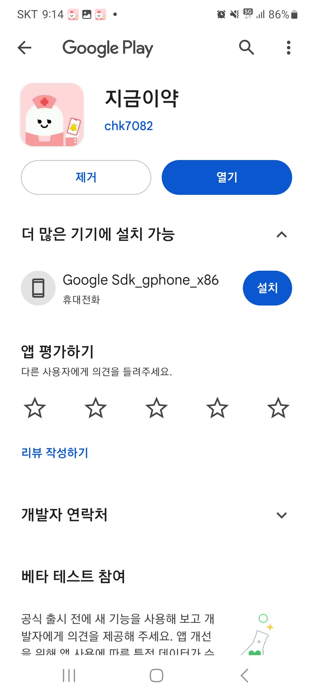

# Containers
모든 컨테이너들은 단일 EC2 인스턴스에서 배포하였다. (host가 같음)

## Spring Boot
> version 3.1.1
> image docker-springboot:latest

Spring Boot Application이 실행되는 컨테이너.

./spring-docker/.env 파일을 Jenkins 컨테이너의 다음 위치에  위치시킨다. /var/jenkins_home/workspace/develop/backend/e-yak 
(Spring Boot 컨테이너에 DB, Redis 연결 정보를 환경 변수에 추가)

## NginX
> version 1.22.1
> image nginx:1.22.1-alpine

Https 통신은 도메인을 발급받은 후 NginX에 certbot을 이용하여 적용하였다. Reverse Proxy 적용. NginX 설정파일은 nginx-docker/data/nginx/app.conf 이다.

## Jenkins
> image jenkins:jdk17

GitLab push시 Jenkins 컨테이너 위에서 Spring Boot Test Code가 실행되기 때문에 DB, Redis 연결 정보를 Jenkins pipeline script 파일상에서 환경 변수에 추가해야 한다.
(Jenkins 컨테이너에 DB, Redis 연결 정보를 환경 변수에 추가)

Jenkins pipeline script 파일은 ./jenkins-docker/Jenkinsfile 이다.

## MariaDB
> version 10.11.4
> image mariadb:10

MariaDB 계정 정보는 ./mariadb-docker/.env 파일에 존재하며, ./mariadb-docker/docker-compose.yml 파일에서 포함시킨다.
두 파일이 속한 디렉토리에서 아래 명령어를 실행하여 MariaDB 컨테이너를 생성한다.

```sh
docker-compose up -d
```

# Android Application
>구글 플레이 스토어에서 '지금이약' 검색 후 설치
> 


# IDE
## IntelliJ IDEA
>Java 17
>version 2023.1.3

## Android Studio
>Kotlin 1.8.20
>version 2022.2.1