# 어플리케이션 사용 설명서

<aside>
💡 어플리케이션 로그인부터 사용 방법까지 안내서

</aside>

---

## 어플리케이션 설명서

---

### 0. 회원가입 / 로그인

**회원가입**

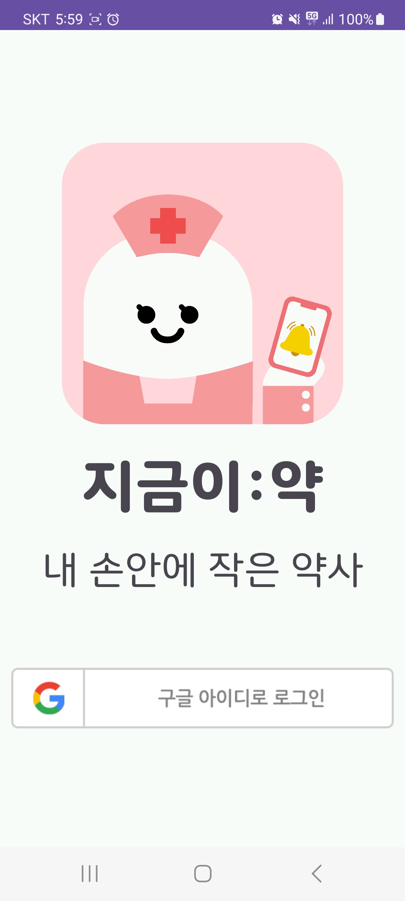

1. 구글 아이디로 로그인 클릭

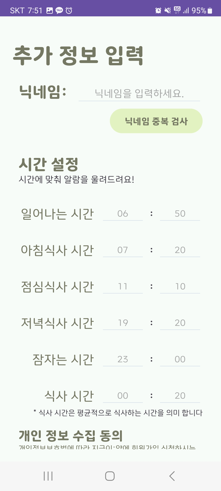

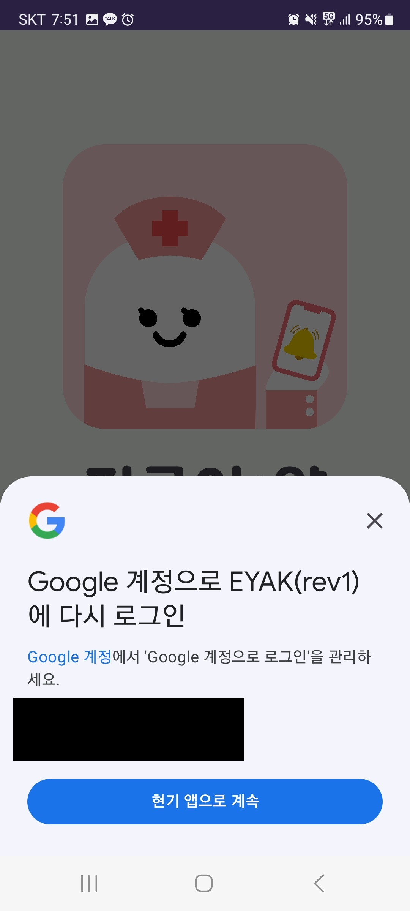

1. 구글 계정(플레이스토어 계정)으로 간편하게 로그인/회원가입 가능

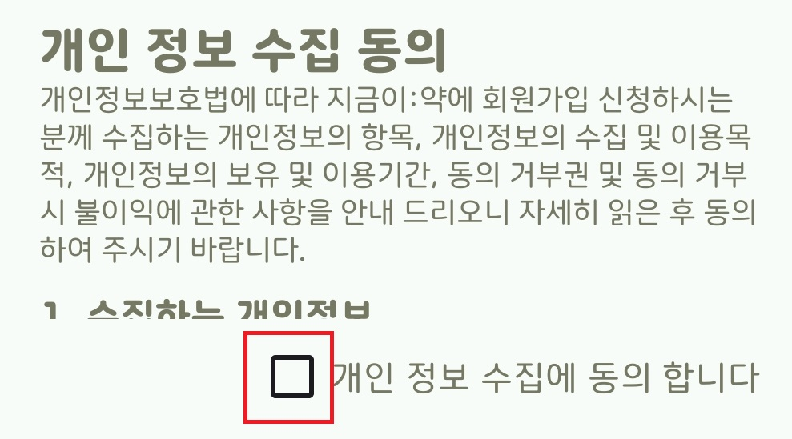

1. 사용하실 닉네임과 시간 정보를 입력해주세요
    - 닉네임은 유저를 식별하는데 사용되고 시간 정보는 복약 관리를 도와주는데 이용된답니다

1. 개인 정보 수집에 동의해주세요
    - 지금이약에서는 고객님의 회원정보를 가족으로 설정한 대상 외에 공개하지 않습니다
1. 회원가입 완료

**로그인**

이후 로그인은 구글 로그인 버튼을 클릭하시거나 자동으로 된답니다

---

### 1. 알람이:약

> 하단의 알람탭에서는 그날 먹어야하는 약과 관련된 정보들을 알려드립니다
>

**알람 확인**

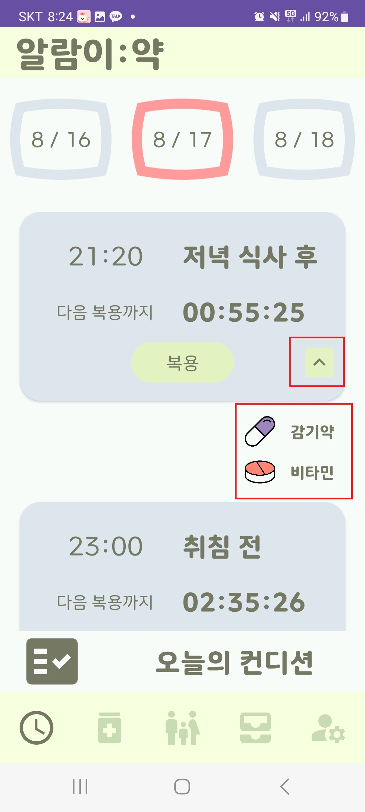

- 알람 탭에서는 오늘 약을 먹어야 하는 시간과 그때 먹어야하는 약에 대한 정보를 한눈에 보실 수 있어요
- 그리고 저 시간이 되면 고객님께 핸드폰으로 알람을 드리고, 스마트 약통에도 알람이 간답니다
- 상단의 가운데 날짜는 오늘을 의미해요
- 양쪽의 날짜를 누르면 이전날, 다음날로 이동할 수 있습니다
    - 날짜별 색상의 의미는 그날 먹을 약을 얼마나 먹었나에요
        - 빨간색 : 전부 미복용
        - 노란색 : 일부 미복용
        - 초록색 : 전부 복용
- 자세한 사용법은 4. 약통이:약을 확인해주세요

**오늘의 컨디션**

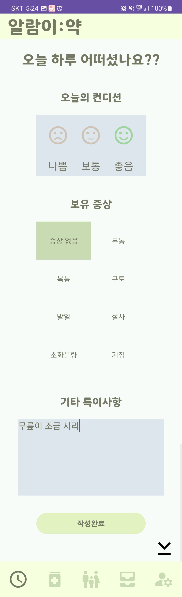

- 알람 탭 하단의 오늘의 컨디션을 입력하면 오늘 약을 먹은 뒤 컨디션, 증상, 기타 특이사항 등을 입력할 수 있답니다

**복용 완료**

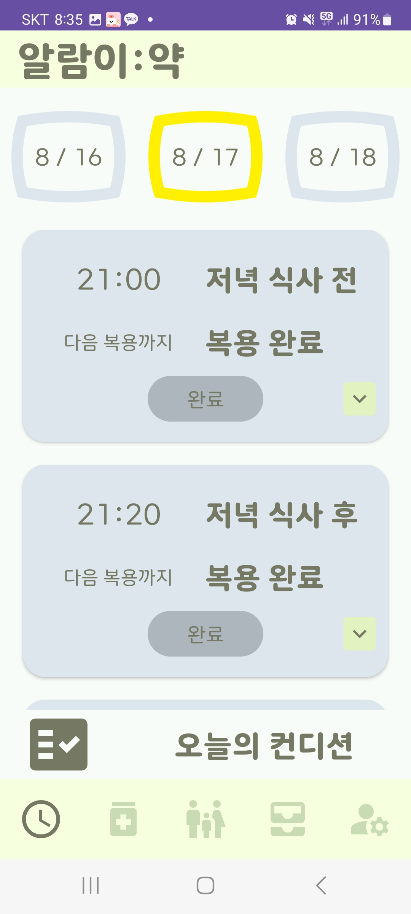

- 알람이 울리고, 약을 드신 후에는 꼭 복용 버튼을 눌러주세요
- 복용 여부는 가족이 확인할 수 있으니, 그들도 안심이 될거에요

---

### 2. 약이:약

> 복약 탭에서는 드시는 약에 대한 정보를 한눈에 확인할 수 있습니다
>

**한눈에 보기**

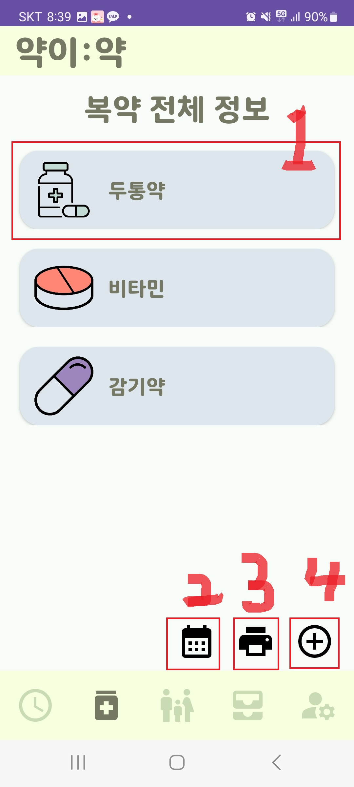

1. 복약 상세 조회
2. 복약 캘린더 조회
3. 복약 정보 pdf 조회
4. 복약 추가

**상세 조회**

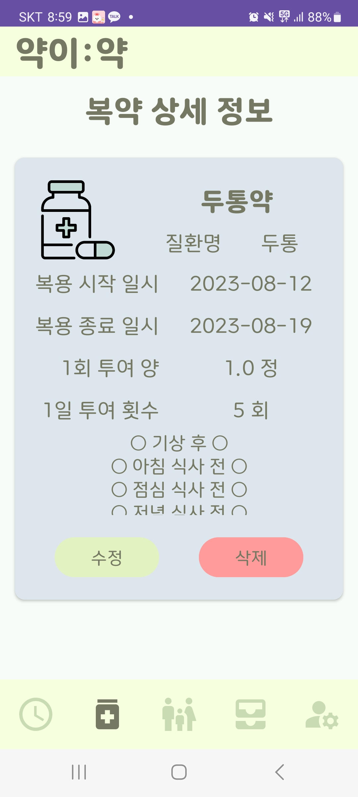

등록했던 상세 정보 확인 가능해요

여기서 수정&삭제가 가능하답니다

**캘린더 조회**

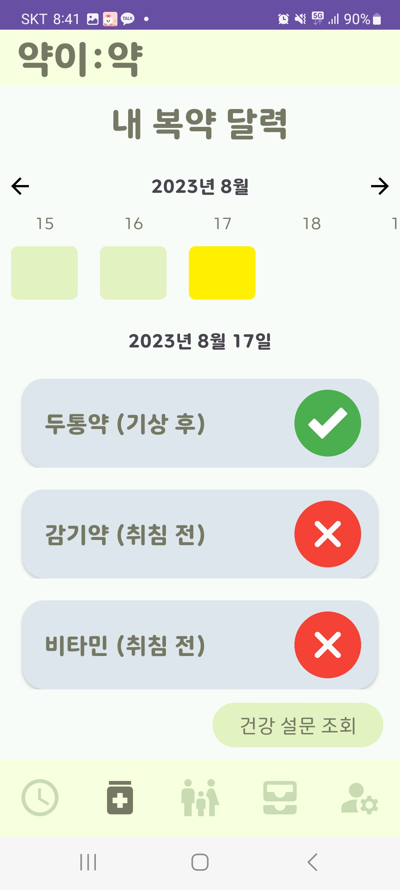

각각의 날짜에 대한 복약 정보, 건강 설문 결과를 한눈에 볼 수 있어요

**pdf 조회**

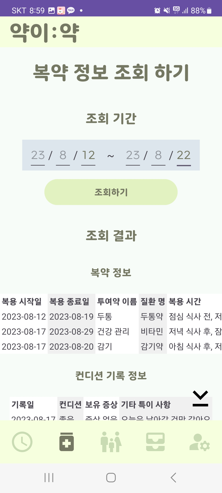

기간을 설정해서 조회할 수 있고, pdf 저장 가능

**복약 추가**

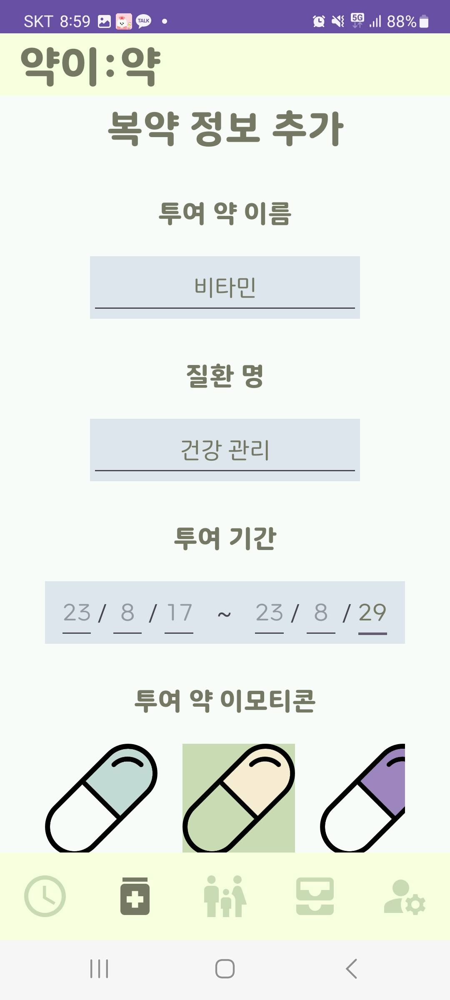

복용할 약에 대한 정보를 등록할 수 있어요

---

### 3. 가족이:약

> 가족 탭에서는 가족을 신청하고 수락하여 자신의 복약 정보를 가족에게 공유할 수 있어요
>

**가족 맺기**

1. 가족 신청

   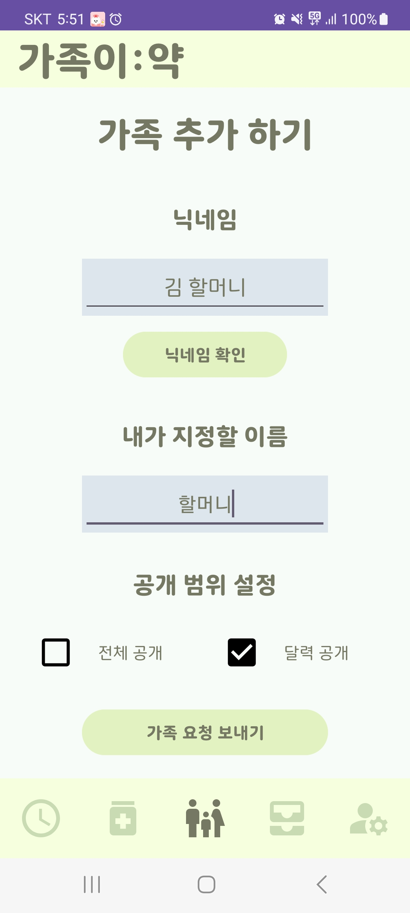

- 가족 탭 우측 하단에 연필 아이콘을 클릭한 뒤 +버튼을 통해서 가족을 신청할 수 있어요

1. 신청 도착

   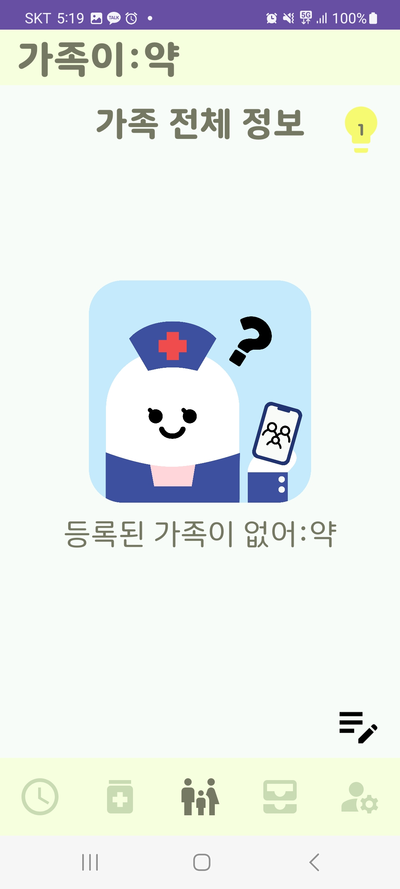

- 우측 상단에 노란 전구를 클릭해주세요

1. 신청 수락

   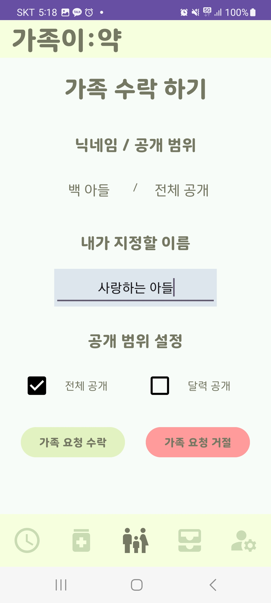

- 가족을 신청할 때와 수락할 때 모두 달력 정보만 공개할 건지, 상세 정보와 건강 설문 결과까지 모두 공개할 것인지 선택할 수 있어요

1. 성공

   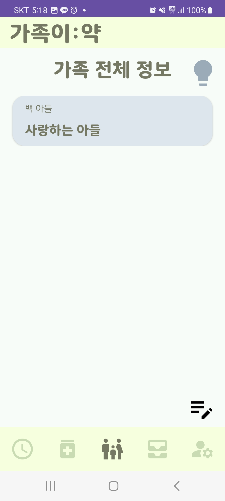

- 가족이 맺어지면 양쪽 모두에게 표시된 답니다

**가족 복약 조회**

1. 가족 클릭

1. 날짜 조회 가능

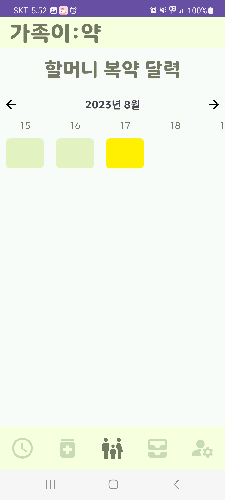

1. 날짜 클릭

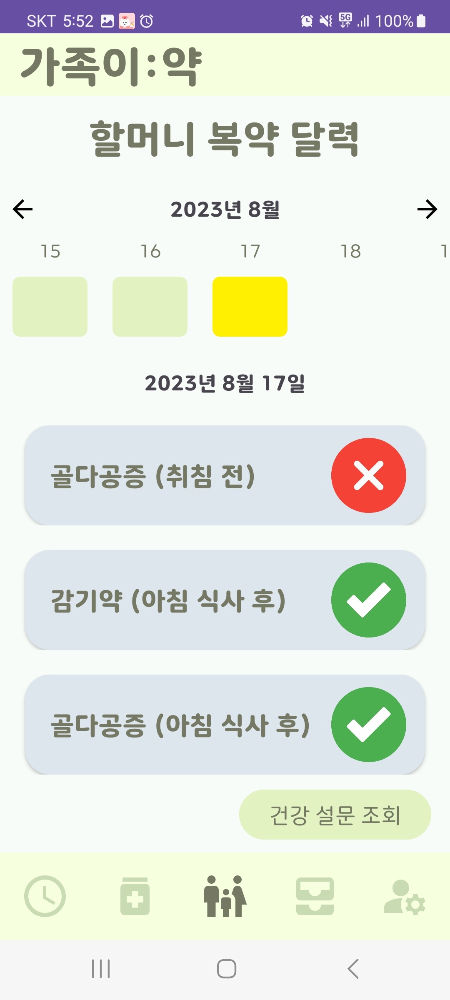

1. 건강 설문 조회

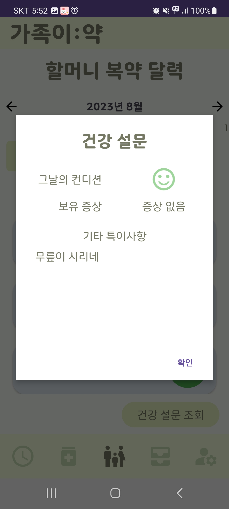

---

### 4. 약통이:약

[약통 디바이스 사용 설명서](https://www.notion.so/cbd8cce51bf24509b498a86e1346f098?pvs=21)

- 위 페이지를 참고해주세요

---

### 5. 내 정보 변경하기

**회원 정보 수정**

하단에서 가장 오른쪽 배너를 클릭하면 회원가입 시 설정하신 정보들을 수정할 수 있습니다

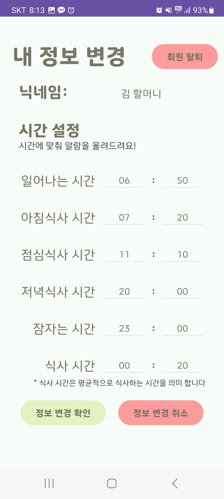

**회원 탈퇴**

회원을 탈퇴하고 싶다면 우측 상단에 회원 탈퇴 버튼을 누르시면 됩니다

- 단, 탈퇴하시면 정보를 정상적으로 복원할 수 없으니 주의해주세요❗