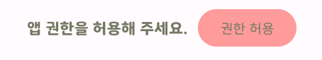
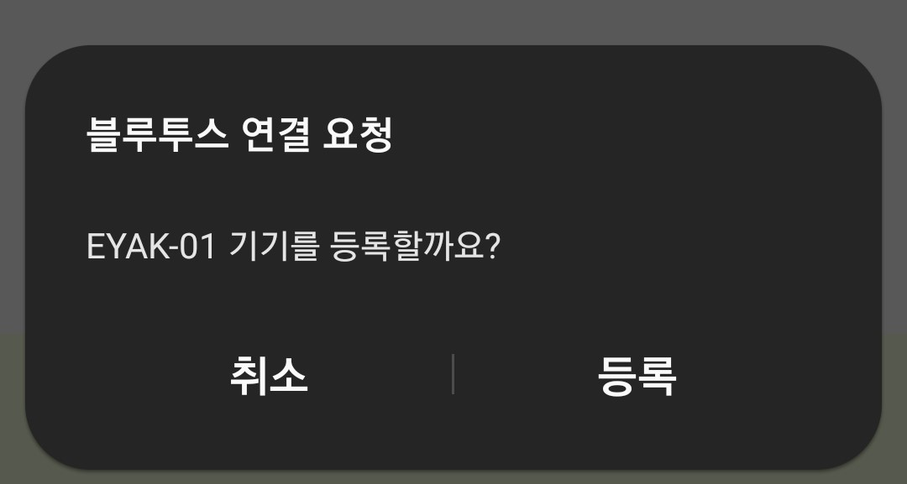

<aside>
💡 약통 등록부터 사용 방법 까지 안내서

</aside>

## 약통 설명서

---

**제작**

- 해당 약통은 PLA 소재로 만들어져 있습니다. 에탄올/알코올 성분에 닿지 않게 해주세요.
- 뚜껑 중앙에 자석 두 개, 통 중앙의 개폐 부위에 자석 한 개, 총 3개의 자석이 들어가 있습니다.
- 약통 양쪽의 안쪽 통 두 개는 분리 및 따로 세척이 가능합니다.

**동작**

- 표면 중앙에 있는 LED가 켜지거나 깜빡거리면 약 복용 알림이 왔다는 표시 입니다.
- 알림 LED가 켜져 있을 동안 중앙의 검은 버튼을 누르면 알림이 꺼집니다.
  알림이 온 직후 1분 동안은 LED 표시가 유지됩니다.
- 안쪽의 중앙 하단의 두 개의 파란색과 빨간색의 LED는 각각 전원 여부와 블루투스 연결 여부를 표시해 줍니다.
    - 파란색 불이 안 들어와 있을 경우 충전이 필요하거나, 전원이 켜지지 않은 겨우 입니다.
      전원 스위치는 오른쪽 통을 분리하면 안쪽 보드 상단에 자리잡고 있습니다.
    - 빨간색 불은 알림이 울릴 경우에 블루투스 연결이 이루어졌다는 표시로 들어오게 되며, 알림을 꼈는데도 빨간 불이 계속 켜져있다면 앱에서 백그라운드로 실행 중인 어플을 종료해 주시길 바랍니다.
- 안쪽의 초록 LED는 어플의 약통 기기 페이지에서 사전 설정한, 복용해야 할 약의 칸을 표시해 줍니다.
- 뚜껑을 닫으면 안쪽의 LED들은 개폐 인식 장치로 인해 자동으로 꺼지고, 뚜껑을 열면 켜집니다.

**충전**

- C타입 충전기로 충전이 가능합니다.

## 약통 앱 연동 설명서

---

### 1. 권한 허용

원활한 약통 사용을 위해 다음의 권한 허용이 필요합니다.

- 근처 기기
- 위치 정보

해당 버튼을 누르면 권한 허용을 요청하는 팝업에서 권한을 허용해 주시면 됩니다.

권한을 거부하거나 아직 허용해야 하는 권한이 존재한다면 위의 버튼을 다시 눌러 허용을 진행할 수 있습니다.

### 2. 블루투스 켜기

약통과 앱은 블루투스를 사용하여 연동됩니다. 해당 버튼을 누르면 블루투스가 켜집니다.

약통 등록과 추후 사용 시, 블루투스가 필수적으로 켜져있는 상태여야 하므로, 반드시 켜주시기 바랍니다.

### 3. 근처 약통 디바이스 찾기

처음 어플을 다운 받으면 약통이 아직 등록되지 않은 상태로, 아래의 화면처럼 나타날 것입니다

.jpg)

여기서 ‘근처 약통 찾기’ 버튼을 눌러 약 12초 동안 근처의 약통 블루투스 기기를 찾아 화면에 띄워줍니다.

본인의 시리얼 넘버에 맞는 약통을 찾아 연결하세요.

.jpg)

약통의 블루투스 기기를 등록하겠습니까 하는 안내문에서 ‘등록’을 눌러주세요.

등록까지 완료되면 아래 화면처럼 뜰 것입니다.

.jpg)

### 4. 약통 정보 한눈에 보기

해당 동그라미 아이콘과 상태 메시지로 약통의 등록 여부를 알 수 있습니다.

_2.jpg)

.jpg)

만일 약통과 연결이 끊어졌다는 메시지가 올라올 경우 약통을 삭제하고 다시 등록할 수 있습니다.

또한, 다른 약통을 사용하고 싶은 경우 기존에 등록된 약통을 삭제하고 다시 등록할 수 있습니다.

.jpg)

또한, 화면의 약 아이콘을 클릭하여 해당 약의 이름을 확인할 수 있습니다.

### 5. 약통 편집하기

위에서 ‘약통 편집하기’ 버튼을 눌러 약통의 약 배치 상태를 변경할 수 있는 설정 페이지로 이동할 수 있습니다.

본인의 가호에 따라 배치하고 싶은 약 아이콘을 손가락으로 길게 누르고 끌어서 배치해 보세요.

약통 하단의 파란 부분에 약 아이콘을 다시 끌어 배치를 취소할 수 있습니다.

약 아이콘을 클릭하면 해당 약의 이름을 상단에 나타내 줍니다.

.jpg)

또한, 이 페이지에서 약통의 알림 방식을 설정할 수 있습니다.

마지막에 반드시 ‘저장하기’를 눌러, 편집 정보를 저장해 주세요!

.jpg)