# 파비콘  
파비콘이랑 웹사이트 또는 웹 페이지를 대표하기 위해 웹 브라우저에서 사용되는 16x16 픽셀의 작은 이미지  
즐겨찾기 아이콘(favorite icon)의 줄임말로 주로 웹 브라우저 상단에 있는 탭에 표시됨  
그 외에도 브라우저의 북마크나 방문 기록, 검색 결과에서 페이지 url과 함께 포시되기도 함

 

# 안드로이드 폰트 사이즈 가이드

- [앱 디자인 시 체크해야 할 텍스트 규정](https://dpectrum.app/blog/104)
 
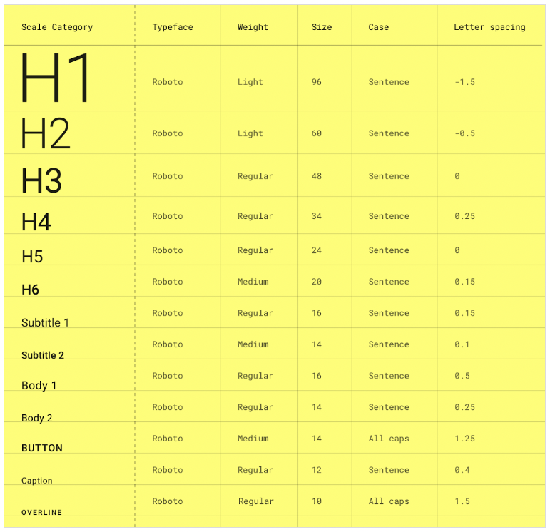
 

# 아이콘

- 시장 조사

 

|GC 어떠케어|helpy|medisafe|MyTherapy|
|---|---|---|---|
|||||

|가시안|귀여운 알약 알림|루티너리|앱 스토어 복약캘린더|
|---|---|---|---|
|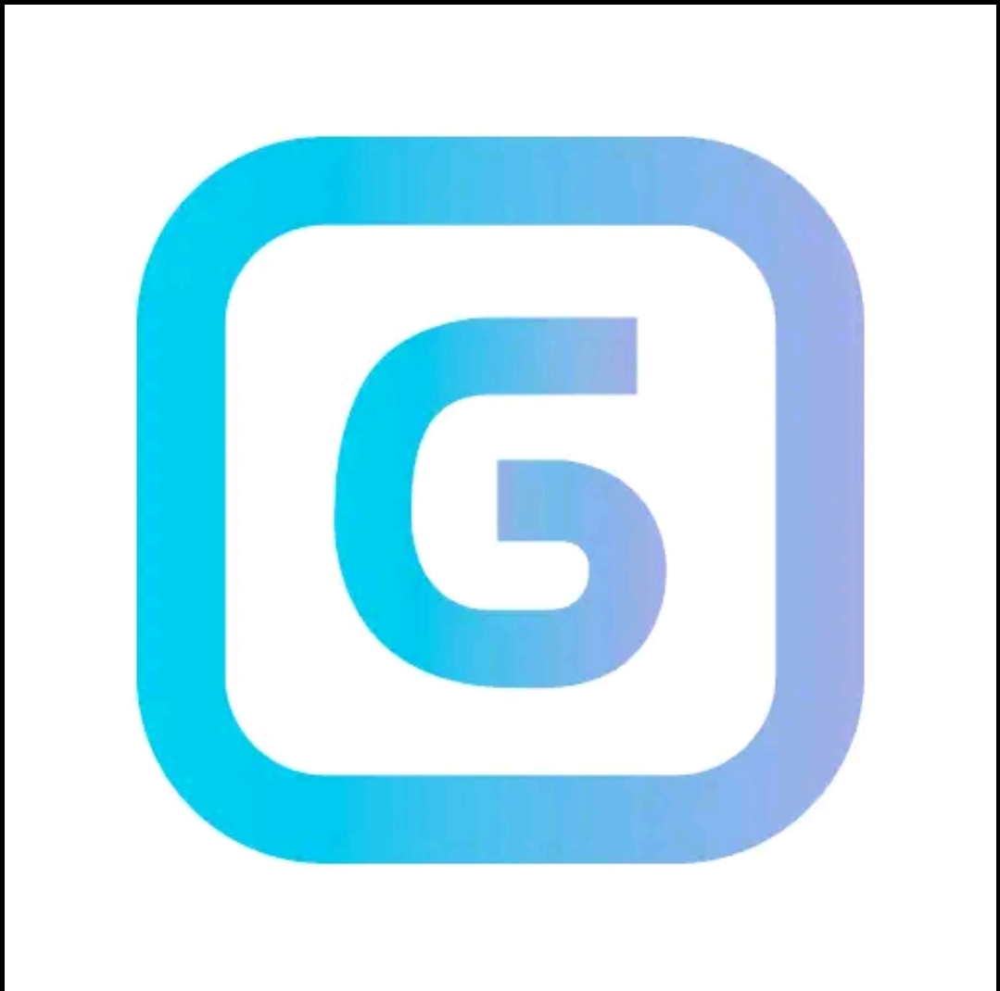||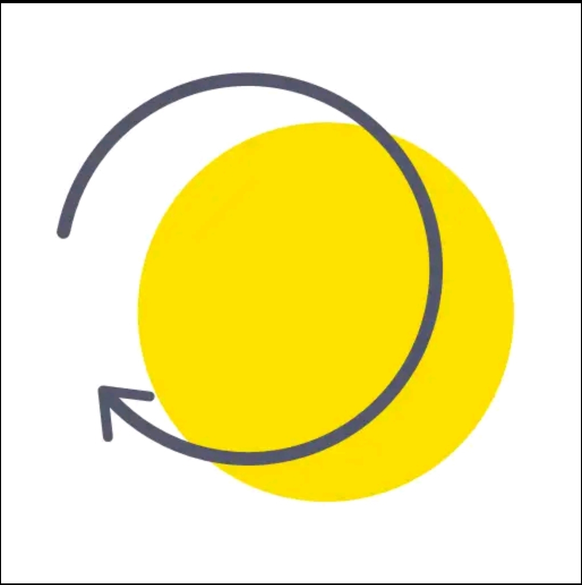||

|오늘의 약|파프리카케어|필 위드|지금이약|
|---|---|---|---|
||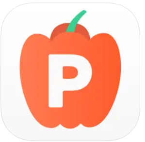|||

- 글씨 형태로 사용되기도 하고, 알약 or 시간 관리 느낌이 드는 이미지를 사용하기도 한다
- 전체적으로 단조로운 색상 구성
- 현재 우리가 사용하는 것도 타 어플들과 유사한 느낌

 

# 컬러 팔레트  
컬러 팔레트란 장치 화면이나 기타 인터페이스에 표시되거나 페인트 및 일러스트레이션 프로그램에 사용되는 색상 및 도구 모음에 표시될 수 있는 전체 색상 범위를 나타냄   

## 지배적인 색 선택하기  

### 색의 의미  

**녹색**  
녹색 계열은 건강, 고요, 자연, 풍족함을 나타냄  
자연, 환경, 유기농, 야회 활동 등과 관련이 있다면 녹색 사용  
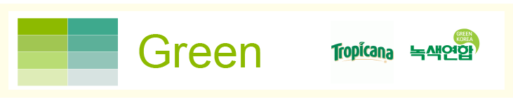  

**파란색**  
파란색 계열은 신뢰, 안전, 안정성, 투명성, 평화를 나타냄  
비즈니스, 은행 등과 관련이 있다면 파란색 사용  
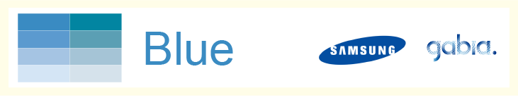  

**노란색**  
노란색 게열은 젊음, 긍정적, 쾌활함을 나타냄  
친근함, 방문자로 하여금 즐거움이나 기쁨을 전달, 사용자의 주의를 끌고 싶다면 노란색 사용  
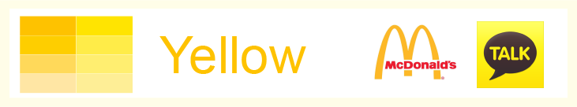  

**빨간색**  
빨간색 계열은 정열, 에너지, 긴급함, 흥분, 위험, 활기를 나타냄  
구매를 부추기거나 강렬한 정서적 반응, 빠른 식사 유도 등에 사용  
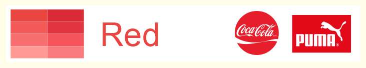  

**검은색**  
검은색은 힘, 권력, 지적임, 고급스러움을 나타냄  
힘과 권력, 전문적인 느낌, 무게감을 느끼게 하는데 사용  
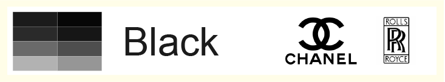  

### 성별에 따른 선호  

남성은 선명한 색, 그늘이 있는 색  
여성은 부드러운 색  
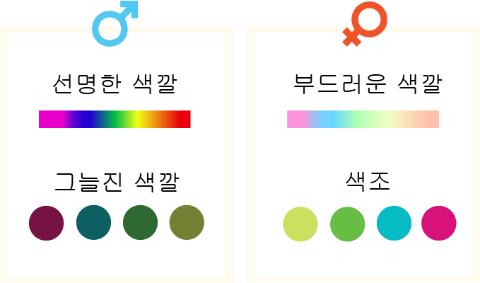  

남성은 파란색, 녹색, 검은색을 선호  
여성은 파란색, 보라색, 녹색을 선호  
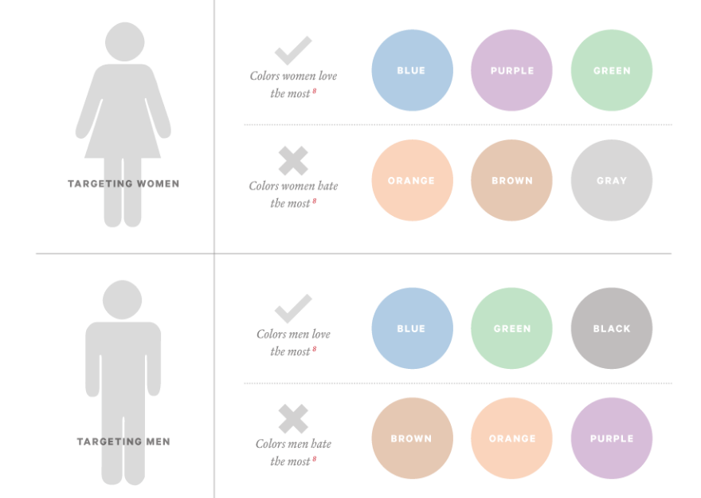  

## 포인트 색상  
지배적인 색상과 잘 어울리면서 제한적으로 사용해야함  
[지배적인 색 고르기](https://www.webfx.com/web-design/color-picker/)에서 지배적인 색을 고르고 [포인트 색 고르기](https://color.adobe.com/ko/create/color-wheel)에서 지배적인 색을 중앙에 넣고 포인트 색을 고름  

## 배경색  
사용자의 시아에 무리를 주지 않고, 콘텐츠에 집중하기 쉬운 색을 선택  
지배적인 색 및 포인트 색과 잘 어울리면서 사용성을 헤치지ㅣ 않는 배경색을 선택할 것  

## 그래서 내 생각은??  

### 범수  
지배적인 색으로는 **3450F5**를 사용하고 포인트 색으로는 **7A28FA** **3923DE** **2370DE** **28B6FA**를 사용하고, 배경색은 **F7FB92**를 사용  
  
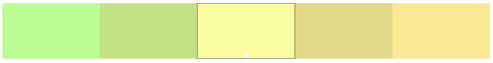  

### 용우  
지배적인 색으로는 **5CFFBB**를 사용하고 포인트 색으로는 **4FE7FF**, **48E8D3**, **48E878**, **44FF52**를 사용하고, 배경색으로는 흰색에 약간 색상이 포함된 **E3FDFF**를 사용  
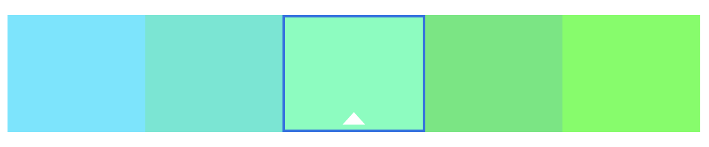  
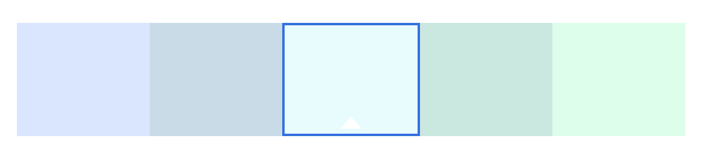  

### 영서  
지배적인 색으로는 **4285F4**를 사용하고 포인트 색으로는 **5437FA**, **3146DE**, **31A1DE**, **37E9FA**를 사용하고, 배경색은 **!!**를 사용  
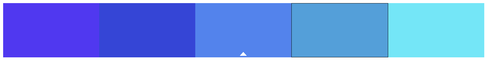

### 서영  
지배적인 색으로는 **7AD581**를 사용하고 포인트 색으로는 **76E3BD**, **7BEDA5**, **97ED7B**, **B7E376**를 사용하고, 배경색은 **FDFFF4**를 사용  
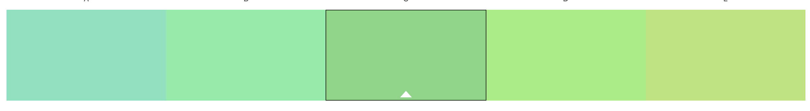  
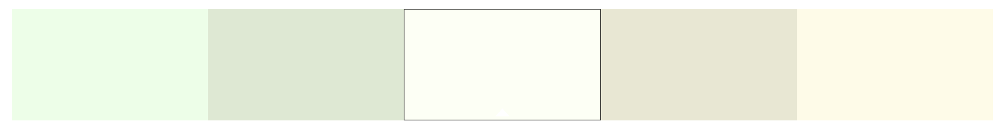  

### 명주  
지배적인 색으로는 **90F1FF**를 사용하고 포인트 색으로는 **82ADFF**, **76BBE8**, **76E8D8**, **82FFCA**를 사용하고, 배경색은 **FCFAF4**를 사용 추가로 지배적인 색으로는 **E7F784**를 사용하고 포인트 색으로는 **8FFC79**, **A8E06C**, **E0D96C**, **FCE679**를 사용  
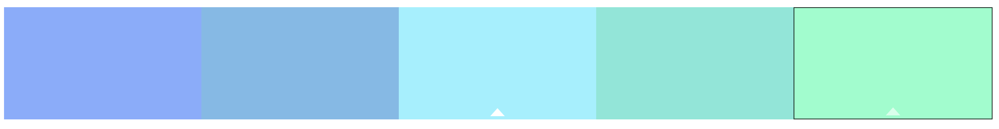  
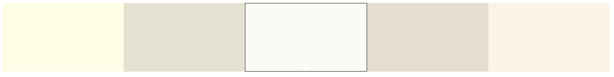  
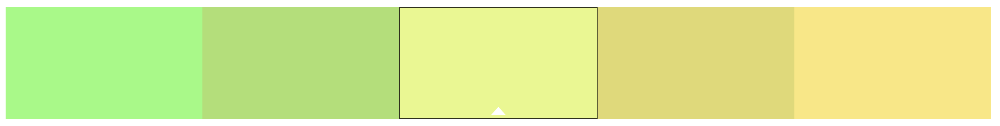

### 현기
지배적인 색으로는 **B3F7B7**를 사용하고 포인트 색으로는 **A9FCDD**, **96E0B0**, **AAE096**, **DCFCA9**를 사용하고, 배경색은 **F8FCF8**를 사용  
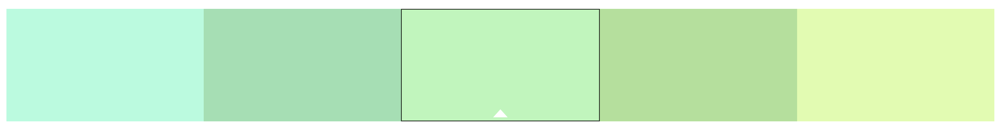  
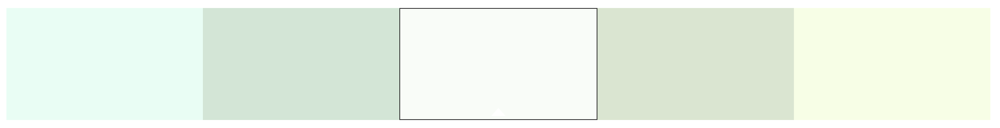

# 글꼴  
상업용 무료 한글 포트는 [눈누](https://noonnu.cc/)에서 쉽게 찾을 수 있음  

## 레퍼런스 조사  
사용하는 모바일 어플의 종류에 따라 레퍼런스를 정리함  
주요 어플 조사는 "내가 봤을 때 괜찮아 보이는 것들"이 주를 이룸  

### 건강 관리 어플  
**Helpy**  
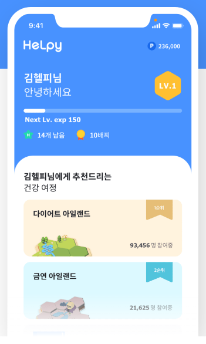{: width="20%" height="20%"}
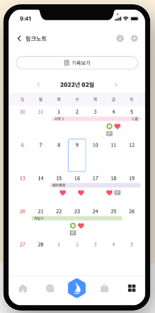{: width="20%" height="20%"}
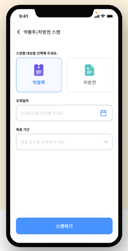{: width="20%" height="20%"}    
젊고 깨끗한 느낌이 듦  
반듯반듯한 글씨  

**CG 케어**  
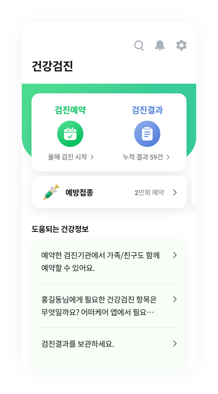{: width="20%" height="20%"}
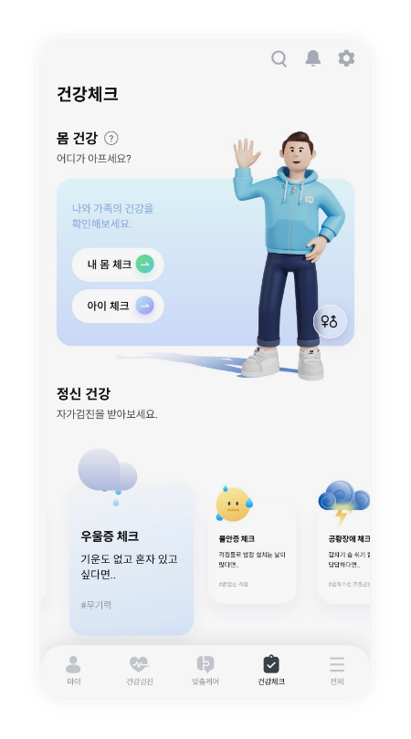{: width="20%" height="20%"}    
둥글 둥글한 글씨를 주로 사용하는 것 같으며 얇고 깨끗함  

**루티너리**  
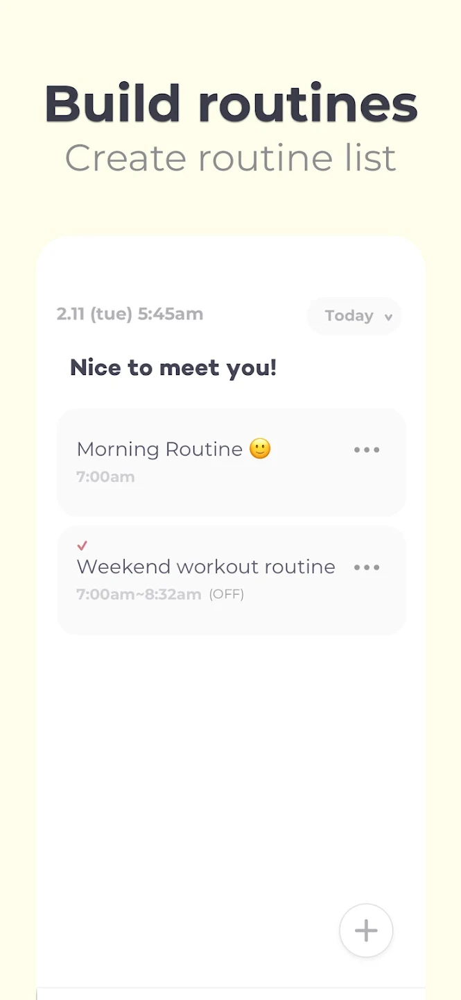{: width="20%" height="20%"}
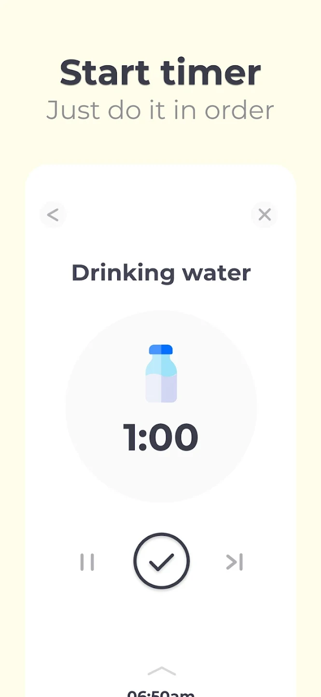{: width="20%" height="20%"}    
적은 양의 정보를 화면에 보여줌으로써 깔끔하게 보이도록 함  
필요한 정보를 담백하게 보여줌  

**가시안**  
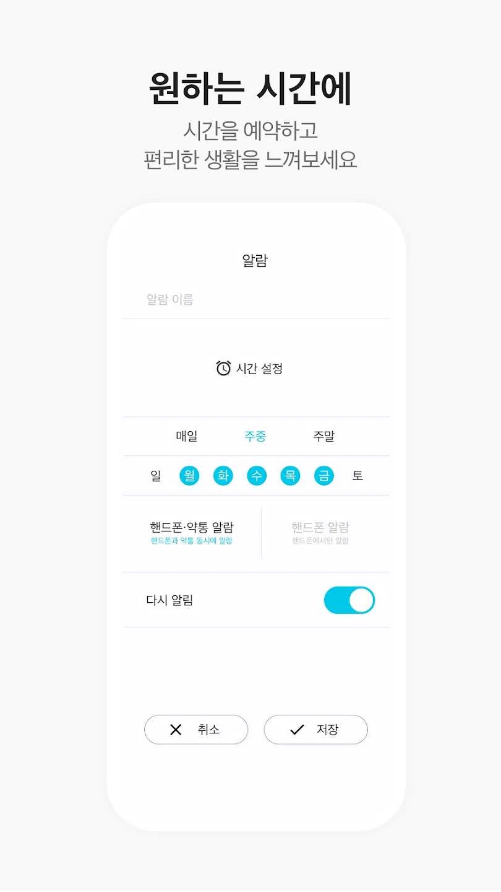{: width="20%" height="20%"}
{: width="20%" height="20%"}  
흰 화면에 깔끔하게 정표를 표시  
스마트 약통 전용 어플이 따로 없는 것 같음  

## 글꼴 후보  
조사한 레퍼런스를 기반으로 폰트 후보를 선정  

**[MBC1961굴림](https://noonnu.cc/font_page/1133)**  
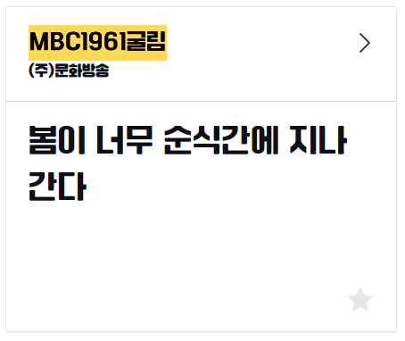  
 

**[김정철고딕](https://noonnu.cc/font_page/1114)**  
  
 

**[광양감동체](https://gwangyang.go.kr/menu.es?mid=a11303090200)**  
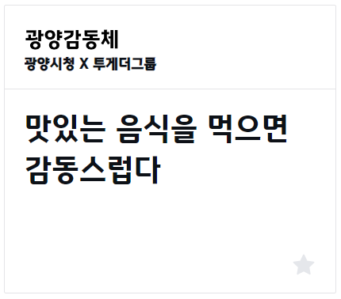  

레퍼런스 표기에 주의 해야 한다  

**[코레일 둥근고딕](https://noonnu.cc/font_page/1072)**  
  

**[수트](https://noonnu.cc/font_page/844)**  
    
폰트의 굵기가 다양한 것이 특징  

**[티머니 둥근바람](https://noonnu.cc/font_page/458)**  
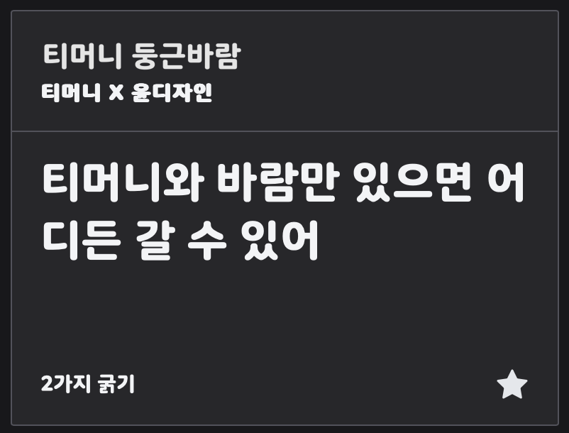  

# 컴포넌트 형식  

- 컴포넌트(Componenent)란 재사용 가능한 독립된 조각을 의미
- 다양한 컴포넌트들을 조합해서 하나의 페이지를 구성하는 것이 용이해진다
- 하나의 독립된 컴포넌트를 다양한 화면에서 재사용 가능

 

- 장점
  - 유지보수 관점
  - 생산성 관점

 

### 지금이약에 필요한 컴포넌트

- [콴다 안드로이드 디자인 컴포넌트](https://blog.mathpresso.com/%EC%BD%B4%EB%8B%A4-%EC%95%88%EB%93%9C%EB%A1%9C%EC%9D%B4%EB%93%9C-%EB%94%94%EC%9E%90%EC%9D%B8-%EC%BB%B4%ED%8F%AC%EB%84%8C%ED%8A%B8-7c86b9da4fe2)
- 지금 당장 저렇게 구체적으로 정하기는 어려워 보이고
- 그때그때 해당 컴포넌트 별로 처음에 만들고 일관성을 유지하면 좋을듯

- 로고
  - 이미지 크기 : 

- 약 아이콘
  - 이미지 크기 : 
  - 

- 추가 버튼 아이콘 ex) 수정 버튼, 설정 버튼, 사용법 버튼, 사용자 페이지 버튼
  - 이미지 크기 : 

- 버튼
  - 높이 : 
  - 배경색
    - 긍정 버튼 : 
    - 부정 버튼 : 

- 입력 폼
  - text 입력폼
    - 높이
  - 날짜 입력폼
    - 다이얼 형식
      - 높이

- 팝업
  - 팝업 뜨는 위치 : ex) 화면 정중앙
  - 배경색 : 
  - 테두리?